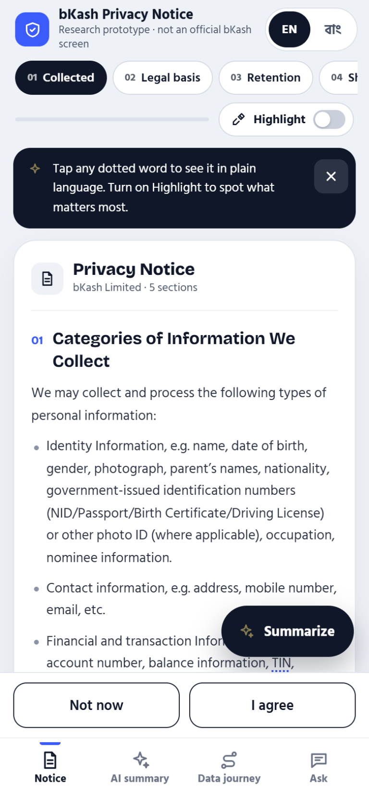

# Privacy Privacy Notice — Research Prototype

[](https://www.figma.com/proto/gV3XI8qkRSyHQSLaQJfhPp/Untitled?node-id=1-3549&m=draw&scaling=min-zoom&content-scaling=fixed&page-id=0%3A1)

*Click the image above to view the interactive prototype on Figma.*

This repository contains the presentation page for a human-computer interaction
(HCI) research prototype that explores how a bilingual, interactive privacy
notice can improve comprehension for users in Bangladesh. The interface is
designed around a bKash privacy-notice scenario, but it is **not an official
bKash product, screen, policy, or endorsement**.

## Contents

- [`index.html`](./index.html) — a lightweight entry page that embeds the Figma
  design prototype.
- [`preview.png`](./preview.png) — a static preview used by this README.
- [`RESEARCH.md`](./RESEARCH.md) — the research description, study framework,
  findings status, and evaluation plan.
- [`LICENSE`](./LICENSE) — the repository’s copyright and usage terms.

## Prototype links

| Resource | Link |
| --- | --- |
| Interactive prototype | [Open the prototype in Figma](https://www.figma.com/proto/gV3XI8qkRSyHQSLaQJfhPp/Untitled?node-id=1-3549&m=draw&scaling=min-zoom&content-scaling=fixed&page-id=0%3A1) |
| Main Figma design file | [Open the design file in Figma](https://www.figma.com/design/gV3XI8qkRSyHQSLaQJfhPp/Untitled?node-id=2-5149&m=draw) |

## Why this prototype exists

Privacy notices often satisfy a disclosure requirement without helping people
understand what will happen to their information. Translation alone does not
solve that problem: users may still struggle with legal vocabulary, long
paragraphs, unfamiliar data categories, and the practical consequences of
consent.

The accompanying research direction, *Translation Is Not Enough: Measuring and
Redesigning Privacy Notice Comprehension for Bilingual Users in Bangladesh*,
motivates a design that treats comprehension as an interaction problem. The
prototype tests whether information can be made easier to scan, compare, and
explain without hiding the underlying notice.

## Design goals

1. **Make disclosure scannable.** Break a long notice into visible sections so
   users can orient themselves and return to a specific topic.
2. **Support bilingual access.** Provide an English/Bangla language control so
   users can choose the language that best supports understanding.
3. **Explain difficult terms in context.** Mark terms that can be opened for
   plain-language explanations instead of forcing users to leave the notice.
4. **Emphasize what matters.** Let users turn on highlighting to identify
   important information while preserving access to the complete notice.
5. **Offer a comprehension aid.** Provide an AI-summary entry point as a
   supplemental explanation, not as a replacement for the original disclosure.
6. **Keep consent visible.** Place “Not now” and “I agree” actions together so
   declining is not hidden and users can make an intentional choice.

## Key interaction model

The supplied preview shows the primary notice-reading state:

- A header identifies the privacy notice and labels the work as a research
  prototype.
- An English/Bangla toggle supports bilingual reading.
- Section chips provide direct navigation through topics such as **Collected**,
  **Legal basis**, and **Retention**.
- A **Highlight** control changes the reading mode to draw attention to
  important content.
- Dotted terms can be tapped for plain-language explanations.
- A **Summarize** action offers a shorter interpretation of the notice.
- Fixed consent actions remain available at the bottom of the screen.
- Bottom navigation separates the notice from **AI summary**, **Data journey**,
  and **Ask** views.

These controls represent a research hypothesis: comprehension may improve when
users can move between the full legal text and layered explanations at the
moment they need them.

## Information architecture

The interface is organized as a guided reading experience rather than a single
undifferentiated document:

1. **Notice** — the complete privacy notice and its section navigation.
2. **AI summary** — a concise explanation intended to help users orient
   themselves before returning to the source text.
3. **Data journey** — a conceptual view of what happens to information across
   collection, use, storage, and related stages.
4. **Ask** — a question-oriented entry point for clarifying unfamiliar parts of
   the notice.

The prototype focuses on the reading and consent experience. It does not
implement a backend, real data processing, production authentication, a live
AI service, or a legally binding consent record.

## Visual and interaction direction

The visual system uses a dark navy and white foundation with bright blue
accents, rounded cards, pill-shaped section controls, and high-contrast
primary actions. This gives the notice a calm, app-like presentation while
preserving a clear reading hierarchy:

- **Navy** establishes the primary text and action emphasis.
- **Blue** identifies the selected state and interactive guidance.
- **Light neutral surfaces** separate the notice content from controls.
- **Large type and generous spacing** support mobile-first scanning.

The static preview is intentionally representative of the design direction,
not a complete record of every Figma frame or interaction state.

## Running locally

No build toolchain or dependency installation is required. Serve the directory
with any static web server, then open `index.html` in a browser.

For example, with Python installed:

```text
python -m http.server 8000
```

Then visit <http://localhost:8000>. The page embeds the Figma design, so the
interactive prototype requires an internet connection and a browser that
allows embedded Figma content. Opening the HTML file directly may be subject
to local browser restrictions; a local web server is recommended.

## Research and evaluation considerations

This design should be evaluated with bilingual users rather than judged only
by visual quality. Useful measures include:

- Correct identification of what data is collected and why.
- Correct understanding of retention, sharing, and user choices.
- Time required to locate a specific answer in the notice.
- Recall and recognition of key terms after reading.
- Differences between English, Bangla, and user-selected language modes.
- Whether summaries and term explanations improve comprehension without
  introducing contradictions.
- Whether users perceive “Not now” and “I agree” as equally available choices.

An evaluation should distinguish **comprehension** from **trust,
readability, task completion, and perceived control**. A shorter summary is not
automatically a more accurate or more understandable disclosure.

## Scope and limitations

- This is a Figma research prototype presented through a minimal HTML page.
- The content is illustrative and must not be treated as legal advice or an
  official bKash privacy policy.
- AI summary and question-answering concepts are visualized only; no model or
  privacy-preserving data pipeline is included.
- The embedded Figma file may change independently of this repository.
- The interface should receive usability, accessibility, localization, and
  legal review before any production use.
- Any real deployment would require explicit consent semantics, secure data
  handling, retention controls, auditability, and a review of Bangla
  terminology by qualified language and privacy experts.

## Credits

Concept, prototype presentation, and repository documentation by **Sibgatul
Hassen**.

The bKash name and related marks belong to their respective owners. They are
used here only to describe the research scenario represented by the prototype.

## License

Copyright © 2026 Sibgatul Hassen. All rights reserved. See
[`LICENSE`](./LICENSE) for the complete terms.
